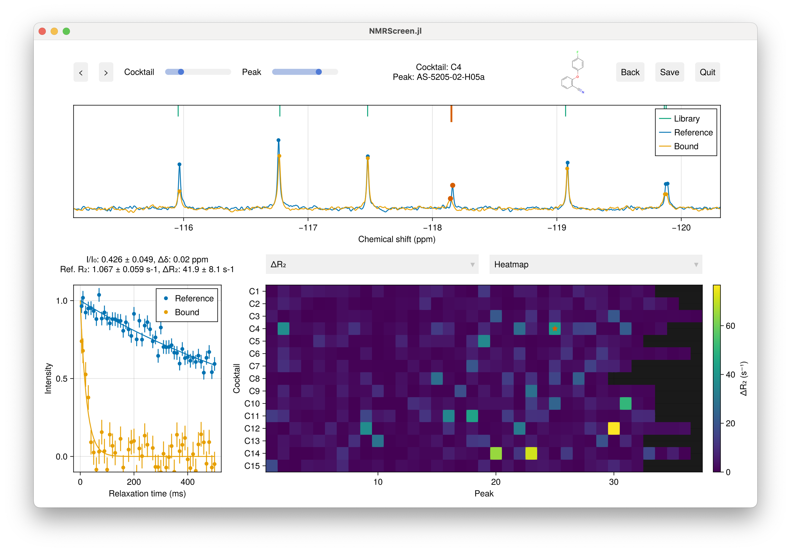
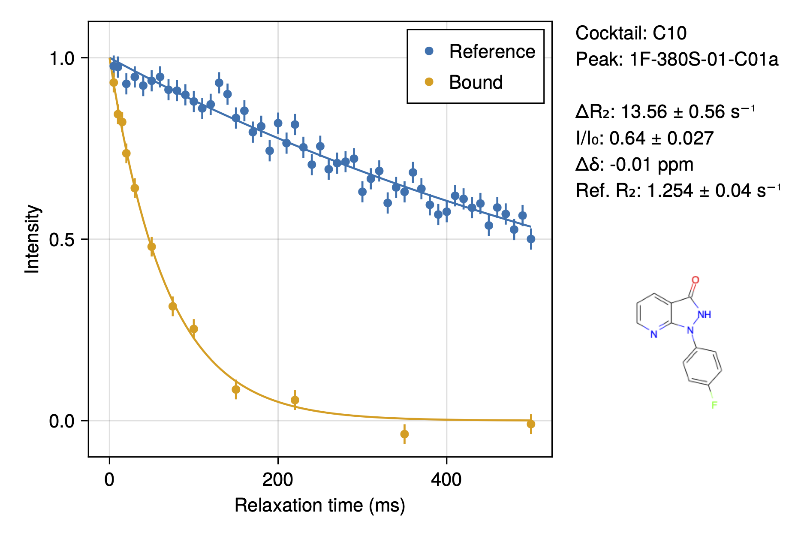

# NMRScreen.jl

NMRScreen.jl is a Julia package for analysis of NMR fragment screening data, currently specialising in 19F R₂ relaxation measurements.



```@contents
Pages = ["index.md"]
Depth = 3
```

## Development Status
NMRScreen.jl is in early development and actively evolving. While the core functionality is stable, you may encounter changes in the API, data formats, and features as we continue to improve the package. We're currently focused on R₂-based screening but plan to expand to other NMR screening approaches in future releases.

We warmly welcome feedback, bug reports, and contributions! If you encounter issues, have feature suggestions, or would like to contribute to development, please visit our GitHub repository at [https://github.com/waudbygroup/NMRScreen.jl]. Even if you're new to Julia, we're happy to help you get started with contributing.


## Quick Start

Using Julia 1.11 or greater:

```julia
using Pkg
Pkg.add("NMRScreen")
using NMRScreen
screen("experiment.toml")
```

## Overview

NMRScreen.jl provides a streamlined workflow for processing and analysing NMR fragment screening data. The analysis proceeds in two stages:

1. Peak Registration: Align observed peaks with the fragment library
2. Analysis: Quantify binding through changes in relaxation rates (ΔR₂) or relative intensities (I/I0)

## Installation

### 1. Install Julia

If you're new to Julia, follow these steps to get started:

1. Download Julia from the official website: https://julialang.org/downloads/
   - Choose the version marked 'Current stable release'
   - Select the correct download for your operating system (Windows, macOS, or Linux)

2. Install Julia:
   - Windows: Run the downloaded installer
   - macOS: Drag the Julia app to your Applications folder
   - Linux: Extract the downloaded file and create a symbolic link to julia in your PATH

3. Verify the installation:
   - Open a terminal (Command Prompt on Windows)
   - Type `julia` and press Enter
   - You should see the Julia REPL (command prompt) with a version number

### 2. Install NMRScreen.jl

1. Start Julia and enter the package manager by typing `]` (right square bracket)
   ```
   julia> ]
   (@v1.11) pkg>
   ```

2. Install NMRScreen.jl:
   ```
   (@v1.11) pkg> add NMRScreen
   ```

3. Exit the package manager by pressing Backspace or Delete when the line is empty

### 3. Test the Installation

1. Load the package:
   ```julia
   julia> using NMRScreen
   ```

2. If there are no error messages, the installation was successful.


## Input File Structure

The experiment is configured through a hierarchy of files that define your screening setup, fragment library, and experimental parameters. Below is a detailed explanation of each required file:

### 1. Experiment Configuration (experiment.toml)

The top-level configuration file defines all aspects of your screening experiment. This TOML file consists of several sections:

```toml
[setup]
name = "BSA Fragment Screen Test"        # Descriptive name for the screen
date = "2024-11-11"                      # Date of data collection
operator = "Chris Waudby"                # Person conducting the screen
spectrometer = "Obi-Wan"                 # Spectrometer name/ID
temperature = 298.0                      # Temperature in Kelvin
tube_diameter = 5                        # NMR tube diameter in mm

[files]
fragment_library = "library.toml"        # Path to library definition file
reference_directory = "BSA_test"         # Directory containing reference spectra
experiment_directory = "BSA_test"        # Directory containing bound spectra
output_directory = "out"                 # Where to save results

[protein]
name = "BSA"                             # Target protein name
concentration = 0.2                      # Protein concentration
concentration_unit = "mg/mL"             # Units for concentration
buffer = "50mM Tris pH 7.4, 100mM NaCl" # Buffer composition

# Each cocktail requires a separate [[cocktails]] section
[[cocktails]]
id = "C1"                               # Must match ID in library
reference = "1"                         # Bruker experiment number for fragment-only control
experiment = "101"                      # Bruker experiment number with protein present

[[cocktails]]
id = "C2"
reference = "2"
experiment = "102"
```

The `reference` and `experiment` numbers in each cocktail section correspond to Bruker experiment numbers in your dataset. These should be pseudo-2D R₂ relaxation measurements.

### 2. Library Definition (library.toml)

The library definition file connects your fragment library information with the cocktail compositions:

```toml
name = "Fluorine Fragment Library Example"  # Descriptive name for the library
cocktails = "cocktails.csv"                 # Path to cocktail definitions
fragments = "fragments.csv"                 # Path to fragment information
```

This file serves as a central reference point for your fragment library, allowing you to maintain multiple libraries or library versions while keeping the cocktail and fragment information in easily editable CSV format.

### 3. Cocktail Definitions (cocktails.csv)

The cocktails file defines the composition of each fragment mixture. This is a comma-separated values (CSV) file with three columns:

```csv
id,name,fragments
C1,Cocktail 1,BF-0702-05-F11,FS-2142-01-C04,PS-6442-06-H02,...
C2,Cocktail 2,DS-7111-05-C02,SS-4432-05-C11,TS-02206-05-H12,...
```

- `id`: Unique identifier that matches the cocktail IDs in experiment.toml
- `name`: Human-readable name for the cocktail
- `fragments`: Comma-separated list of fragment IDs present in this cocktail

Each fragment ID must correspond to an entry in fragments.csv. The order of fragments is not important, but accuracy is crucial - every fragment ID must be exactly as it appears in your fragments.csv file.

### 4. Fragment Definitions (fragments.csv)

The fragments file contains detailed information about each fragment in your library. This CSV file has the following columns:

```csv
id,smiles,concentration,shifts/heights
AS-8515-02-E06,COc1ccc2c(N)nn(C)c2c1F,128.20,-160.8800661,1
NC-0761-06-D05,FC2(=CN1(C(=NC(=C1)C(=O)OCC)C=C2)),119.40,-138.0534395,1
PS-8226-02-B10,ClC=1(C2(=C(N=CC=1)C(F)=CC(=C2)F)),88.28,-107.4864436,1,-107.5015476,1,-119.8637491,1,-119.8788532,1
```

- `id`: Unique identifier for the fragment (must match IDs used in cocktails.csv)
- `smiles`: Chemical structure in SMILES format
- `concentration`: Fragment concentration in μM
- `shifts/heights`: Pairs of numbers representing chemical shift (in ppm) and relative height for each peak

For fragments with multiple fluorine peaks (like PS-8226-02-B10 above), the shifts/heights pairs are repeated for each peak. This allows accurate peak matching and quantification for fragments with multiple fluorine environments.

Important notes:
- Chemical shifts should be referenced consistently with your experimental data
- Heights should be set to 1 unless you have specific reason to expect different relative intensities - this is not used at present
- Multiple peaks for a single fragment will be automatically labelled with suffixes (a, b, c, etc.) in the analysis output

## Interactive Analysis

### Peak Registration GUI

The first stage aligns observed peaks with the fragment library:


Keyboard shortcuts:
- ←/→: Navigate between peaks
- SHIFT + ←/→: Navigate between peaks within the same fragment
- ↑/↓: Navigate between cocktails
- '[' / ']': Nudge reference peak left/right (SHIFT for next maximum)
- ',' / '.': Nudge bound peak left/right (SHIFT for next maximum)
- Control-click: Reset zoom
- Right-drag: Pan spectrum

### Analysis GUI

The second stage quantifies binding through ΔR₂ analysis:


Keyboard shortcuts:
- ←/→: Navigate between peaks
- SHIFT + ←/→: Navigate between peaks within the same fragment
- ↑/↓: Navigate between cocktails
- Mouse wheel: Adjust heatmap scale / spectrum zoom level
- Click points on heatmap / chemical space map: Select peak
- Control-click: Reset zoom of spectrum / chemical space map
- Right-drag: Pan spectrum / chemical space map

## Output Files

Results are saved in the specified output directory:

1. **top_fragments.pdf**: Fragments ranked by ΔR₂ with distribution histogram


2. **Heatmaps**: Visualisations of:
   - ΔR₂ vs cocktail and peak number
   - Chemical shift perturbations (free/bound)
   - Intensity ratios (I/I₀)
   - Relaxation fitting quality (reduced χ²)
   - Reference R₂ (for aggregation detection)


3. **Result cards**: PDF summary for each peak



4. **results.csv**: Complete numerical results including:
   - Fragment and cocktail identifiers
   - Chemical shifts (library, reference, bound)
   - Intensity ratios with errors
   - Chemical shift perturbations
   - R₂ values (reference, bound) with errors
   - ΔR₂ with errors
   - Fitting quality metrics

## Peak Naming Convention

Multiple peaks from a single fragment are distinguished by letter suffixes (e.g., PS-8104-06-D02a, PS-8104-06-D02b).

## Data Requirements

1. Bruker format pseudo-2D R₂ relaxation data
2. Reference (fragment-only) and bound (fragment + protein) experiments
3. Fragment library definition with accurate chemical shifts

## Tips for Success

1. Ensure accurate chemical shift referencing between experiments
2. Check for compound aggregation through reference R₂ values
3. Consider intensity changes alongside ΔR₂
4. Validate fits using reduced χ² and visual inspection
5. Be cautious of overlapped peaks in cocktail spectra